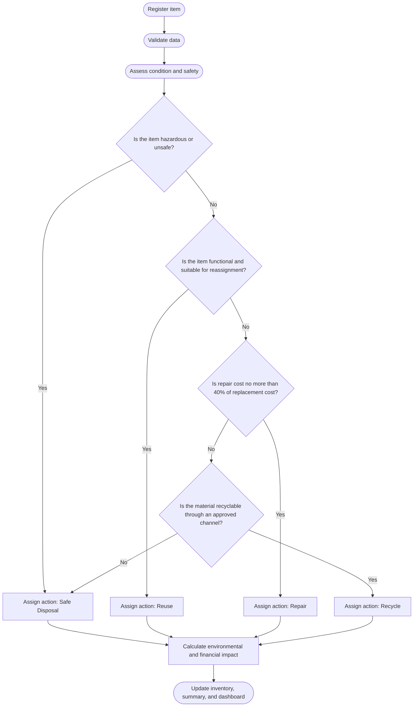

# E-Waste Tracking and Decision-Support System

## A Simulated Case Study for East West University

This project proposes a lightweight **e-waste inventory and decision-support framework** for a university environment. It demonstrates how electronic waste can be registered, assessed, categorized, and directed toward one of four management pathways:

- **Reuse**
- **Repair**
- **Recycle**
- **Safe Disposal**

The project uses a structured simulated dataset, a transparent rule-based decision-support method, environmental and financial calculations, and an Excel dashboard.

> **Important:** The dataset is simulated for academic use. It does not contain East West University’s actual asset, procurement, maintenance, repair, or disposal records.

---

## Table of Contents

- [Project Overview](#project-overview)
- [Green Computing Relevance](#green-computing-relevance)
- [Project Objectives](#project-objectives)
- [Computational Artifact](#computational-artifact)
- [Dataset](#dataset)
- [Decision-Support Method](#decision-support-method)
- [Process Flow](#process-flow)
- [Environmental Calculations](#environmental-calculations)
- [Financial Calculations](#financial-calculations)
- [Results](#results)
- [Workbook Structure](#workbook-structure)
- [Repository Structure](#repository-structure)
- [How to Use the Project](#how-to-use-the-project)
- [Assumptions](#assumptions)
- [Limitations](#limitations)
- [Future Improvements](#future-improvements)
- [Stakeholders](#stakeholders)
- [Individual Contributions](#individual-contributions)
- [Academic Integrity Notice](#academic-integrity-notice)
- [License](#license)

---

## Project Overview

Universities regularly replace or retire computers, monitors, printers, batteries, UPS devices, mobile devices, and networking equipment. Without a formal tracking process, institutions may:

- discard functional devices prematurely;
- replace devices that could be repaired;
- lose recoverable materials;
- send recyclable equipment to landfills;
- mishandle batteries and other hazardous components;
- lose accountability during transfer and disposal.

This project addresses those problems by providing a structured inventory and a decision-support workflow for institutional e-waste management.

---

## Green Computing Relevance

The project is related to **Green Computing** because it supports environmentally responsible management of computing resources at the end of their useful life.

It promotes:

- longer device life through reuse;
- repair instead of unnecessary replacement;
- recovery of materials through recycling;
- safe handling of hazardous electronic components;
- reduction of landfill waste;
- improved institutional resource efficiency;
- measurement of environmental and financial outcomes.

The project connects computing with sustainability through structured data, decision rules, automated calculations, and dashboard visualization.

---

## Project Objectives

The main objectives are to:

1. Identify common categories of institutional e-waste.
2. Define the data fields required for e-waste tracking.
3. Classify item condition and safety.
4. Recommend reuse, repair, recycling, or safe disposal.
5. Estimate e-waste quantity and weight.
6. Estimate potential carbon benefit.
7. Estimate financial savings and recovery value.
8. Present the results through an Excel dashboard.
9. Discuss practical deployment requirements and limitations.

---

## Computational Artifact

The main computational artifact is an Excel workbook:

```text
EWU_Ewaste_Inventory_Dashboard.xlsx
```

It includes:

- a complete simulated e-waste inventory;
- assumptions and scenario factors;
- formula-driven summaries;
- KPI cards;
- action and category charts;
- environmental-impact calculations;
- financial estimates.

Supporting files include:

```text
EWU_Simulated_Ewaste_Dataset.csv
East_West_University_Ewaste_Report.pdf
East_West_University_Ewaste_Report.docx
```

---

## Dataset

The project uses a **simulated dataset of 100 e-waste records** across ten device categories.

### Device Categories

| Category | Number of Items |
|---|---:|
| Desktop Computer | 18 |
| Laptop | 15 |
| Monitor | 16 |
| Keyboard | 12 |
| Mouse | 10 |
| Printer | 8 |
| UPS | 7 |
| Battery | 8 |
| Mobile Device | 4 |
| Network Device | 2 |
| **Total** | **100** |

### Main Data Fields

| Field | Purpose |
|---|---|
| Item ID | Unique record identification |
| Category | Type of electronic device |
| Department | Current owner or institutional location |
| Age | Estimated age of the device |
| Condition | Physical or operational condition |
| Weight | Estimated device weight in kilograms |
| Repair Cost | Estimated cost of repair |
| Replacement Cost | Estimated cost of buying a replacement |
| Hazardous Component | Whether the device contains a potentially hazardous component |
| Recommended Action | Reuse, Repair, Recycle, or Safe Disposal |
| Decision Rationale | Explanation of the recommendation |
| Estimated CO2e Benefit | Scenario-based environmental estimate |
| Estimated Direct Saving | Scenario-based financial estimate |

### Data Source Declaration

The dataset is **not real institutional data**. It was generated for academic demonstration using predefined category distributions, condition assumptions, cost assumptions, environmental factors, and a reproducible random seed.

No private university database, physical audit, sensor device, RFID reader, electricity meter, recycler certificate, or internal maintenance record was used.

---

## Decision-Support Method

The project uses a **custom rule-based decision-support method**.

It is not a machine-learning model. The method uses explicit `IF–THEN` rules so that every recommendation can be explained and manually reviewed.

### Decision Rules

#### Rule 1: Safety First

If an item is leaking, burnt, contaminated, physically unsafe, or otherwise hazardous:

```text
Recommended Action = Safe Disposal
```

Safety overrides economic considerations.

#### Rule 2: Reuse

If an item is functional, safe, and suitable for reassignment:

```text
Recommended Action = Reuse
```

#### Rule 3: Repair

If an item is not currently functional but can be repaired economically:

```text
Repair Cost <= 40% of Replacement Cost
```

then:

```text
Recommended Action = Repair
```

#### Rule 4: Recycle

If repair is not economical but the item can be processed by an approved recycler:

```text
Recommended Action = Recycle
```

#### Rule 5: Safe Disposal

If the item cannot be safely reused, repaired, or recycled:

```text
Recommended Action = Safe Disposal
```

### Pseudocode

```text
START

Register item
Validate required fields
Assess condition and safety

IF item is hazardous or unsafe:
    Recommend Safe Disposal
ELSE IF item is functional and suitable for reassignment:
    Recommend Reuse
ELSE:
    Repair Ratio = Repair Cost / Replacement Cost

    IF Repair Ratio <= 0.40:
        Recommend Repair
    ELSE IF item is recyclable through an approved channel:
        Recommend Recycle
    ELSE:
        Recommend Safe Disposal

Calculate environmental benefit
Calculate financial value
Update summary and dashboard

END
```

---

## Process Flow



---

## Environmental Calculations

The project estimates potential environmental benefit using item weight and an assumed action factor.

### Item-Level Equation

```text
CO2e Benefit = Item Weight x Action Factor
```

### Total Equation

```text
Total CO2e Benefit = Sum of all item-level CO2e benefits
```

### Illustrative Factors

| Recommended Action | Assumed Benefit Factor |
|---|---:|
| Reuse | 3.00 kg CO2e per kg |
| Repair | 2.20 kg CO2e per kg |
| Recycle | 1.10 kg CO2e per kg |
| Safe Handling / Disposal | 0.15 kg CO2e per kg |

> These factors are illustrative scenario coefficients. They are not audited product-specific life-cycle assessment factors.

### Circular-Pathway Rate

```text
Circular-Pathway Rate =
(Reuse Items + Repair Items + Recycle Items) / Total Items x 100
```

### Weight-Diversion Rate

```text
Weight-Diversion Rate =
(Total Weight - Safe Disposal Weight) / Total Weight x 100
```

---

## Financial Calculations

### Reuse Saving

```text
Reuse Saving = 70% x Replacement Cost
```

### Repair Saving

```text
Repair Saving = Replacement Cost - Repair Cost
```

### Recycling Recovery Value

```text
Recovery Value = Item Weight x BDT 120 per kg
```

> These values are scenario assumptions and should not be interpreted as official institutional accounting results.

---

## Results

The simulated dataset produced the following results:

### Action Distribution

| Recommended Action | Items | Share | Weight |
|---|---:|---:|---:|
| Reuse | 28 | 28% | 102.88 kg |
| Repair | 24 | 24% | 132.59 kg |
| Recycle | 38 | 38% | 169.91 kg |
| Safe Disposal | 10 | 10% | 50.14 kg |
| **Total** | **100** | **100%** | **455.52 kg** |

### Main KPIs

| KPI | Simulated Result |
|---|---:|
| Total Items | 100 |
| Total E-Waste Weight | 455.52 kg |
| Circular-Pathway Items | 90 |
| Circular-Pathway Rate | 90% |
| Weight-Diversion Rate | Approximately 89% |
| Estimated CO2e Benefit | 794.80 kg CO2e |
| Estimated Direct Saving | BDT 1,155,794 |

> These are simulated scenario outputs, not verified East West University performance figures.

---

## Workbook Structure

### 1. Dashboard

Displays:

- total items;
- total e-waste weight;
- circular-pathway rate;
- weight-diversion rate;
- estimated CO2e benefit;
- estimated direct saving;
- safe-disposal weight;
- replacement value;
- action-distribution chart;
- weight-by-action chart;
- category-distribution chart.

### 2. Inventory

Contains the 100 simulated item records and all item-level calculations.

### 3. Summary

Contains formula-driven totals by:

- management action;
- item category;
- weight;
- CO2e benefit;
- direct saving.

### 4. Assumptions

Documents:

- simulated-data disclaimer;
- category distribution;
- environmental factors;
- financial factors;
- repair threshold;
- dataset-generation method.

---

## Repository Structure

A recommended GitHub repository structure is shown below:

```text
EWU-Ewaste-Decision-Support/
|
|-- README.md
|-- LICENSE
|
|-- data/
|   |-- EWU_Simulated_Ewaste_Dataset.csv
|
|-- dashboard/
|   |-- EWU_Ewaste_Inventory_Dashboard.xlsx
|
|-- report/
|   |-- East_West_University_Ewaste_Report.pdf
|   |-- East_West_University_Ewaste_Report.docx
|
|-- figures/
|   |-- architecture_diagram.png
|   |-- decision_flow.png
|   |-- dashboard_screenshot.png
|

```

---

## How to Use the Project

### Option 1: Use the Excel Dashboard

1. Download or clone the repository.
2. Open:

   ```text
   dashboard/EWU_Ewaste_Inventory_Dashboard.xlsx
   ```

3. Review the `Assumptions` sheet first.
4. Open the `Inventory` sheet to inspect the item-level records.
5. Open the `Summary` sheet to review calculations.
6. Open the `Dashboard` sheet to view KPIs and charts.

### Option 2: Replace the Simulated Data

To adapt the project to a real institution:

1. Conduct a physical e-waste audit.
2. Replace simulated rows with verified item records.
3. Validate repair and replacement costs.
4. Add recycler and disposal information.
5. Replace illustrative environmental factors with verified sources.
6. Recalculate all dashboard indicators.
7. Obtain institutional approval before making disposal decisions.

### Clone the Repository

```bash
git clone https://github.com/USERNAME/EWU-Ewaste-Decision-Support.git
cd EWU-Ewaste-Decision-Support
```

Replace `USERNAME` with the actual GitHub account name.

---

## Assumptions

The project assumes that:

- the institutional scenario contains 100 e-waste items;
- item weights are reasonable estimates;
- repair is economical when cost is no more than 40% of replacement cost;
- approved recycling channels are available;
- functional devices can be reassigned;
- hazardous items are handled separately;
- financial values are illustrative;
- environmental coefficients are illustrative;
- recommendations are reviewed by authorized personnel.

---

## Limitations

The main limitations are:

- simulated rather than real institutional data;
- no physical inspection or asset audit;
- no sensor or RFID integration;
- no real-time database;
- no user authentication;
- no institutional approval workflow;
- no verified recycler information;
- no automatic data-wiping confirmation;
- no product-specific life-cycle assessment;
- simplified decision rules;
- assumed costs and environmental factors;
- no operating-energy comparison between old and new devices.

The prototype supports decisions but should not replace technical inspection, environmental assessment, or institutional authorization.

---

## Future Improvements

Future versions may include:

- a web-based inventory system;
- role-based authentication;
- QR code or RFID asset tracking;
- mobile inspection forms;
- integration with procurement and maintenance records;
- approval workflows;
- recycler certificate storage;
- verified data-wiping records;
- product-specific carbon factors;
- operational energy-consumption analysis;
- predictive failure analysis;
- real institutional audit data;
- regulatory compliance reporting.

---

## Stakeholders

### IT Department

- inspect devices;
- test functionality;
- estimate repair feasibility;
- perform secure data wiping.

### Asset Management and Administration

- verify ownership and records;
- approve transfer and disposal;
- maintain chain-of-custody documentation.

### Procurement and Finance

- verify replacement costs;
- review repair economics;
- record financial savings and recovery values.

### Academic and Administrative Departments

- report unused or damaged devices;
- return assets properly;
- confirm item transfer.

### Approved Recycler

- collect recyclable items;
- handle hazardous materials;
- provide recycling or handover certificates.

### University Management

- approve policy;
- assign responsibilities;
- allocate resources;
- monitor compliance.

---

## Individual Contributions

Update this table before submission.

| Group Member | Student ID | Main Contribution | Percentage |
|---|---|---|---:|
| Member 1 | ID | Problem definition, introduction, assumptions, and report writing | 25% |
| Member 2 | ID | Dataset preparation, calculations, and result analysis | 25% |
| Member 3 | ID | Decision rules, methodology, architecture, and flowchart | 25% |
| Member 4 | ID | Excel dashboard, visualization, formatting, and presentation | 25% |
| **Total** |  |  | **100%** |

Contribution percentages should reflect the actual work completed by each member.

---

## Academic Integrity Notice

This repository presents a simulated academic case study. Users must not claim that:

- the data came from East West University;
- the university officially approved the system;
- the environmental values are audited;
- the financial values are official;
- the action distribution represents actual university performance.

For real deployment, the simulated dataset and factors must be replaced with verified institutional data and approved environmental methodology.

---

## License

This project is intended for academic and educational use.

A suitable repository license is the **MIT License**, unless the course instructor or institution requires a different license.

---

## Project Summary

```text
Environmental Problem:
Institutional e-waste may be poorly tracked, prematurely discarded,
or handled through unsafe disposal pathways.

Computing Technique:
Structured inventory data, a transparent rule-based decision-support
method, automated Excel calculations, and dashboard visualization.

Measurable Sustainability Benefit:
Estimated reuse, repair, recycling, waste diversion, CO2e benefit,
and financial savings under a clearly disclosed simulated scenario.
```
